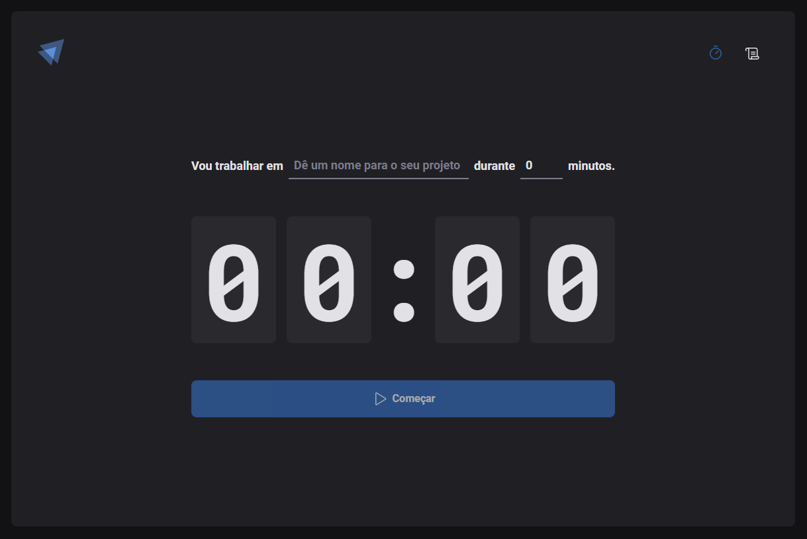

<div align="center">
  
</div>

<h1 align="center">
Ignite Timer 
</h1>

<h2 align="center">Preview: <a href="https://ignite-timer-react-gold.vercel.app" target="_blank">Ignite Timer</a> </h2>

---

<div align="center">
  
</div>

## 📄 Projeto
Projeto que permite ao usuário cronometrar as suas tarefas no dia a dia, além de permitir ver um histórico de todas as tarefas já realizadas.
Aplicação de conceitos como roteamento, ContextAPI, useReducer, Controlled e Uncontrolled Inputs.

## 💻 Tecnologias

- **ReactJS**
- **TypeScript**
- **React Router DOM**
- **Styled Components**
- **React Hook Form**
- **Zod**
- **Immer**
- **date-fns**

## 🔖 Layout
- [Ignite Timer - Figma](https://www.figma.com/file/1elaE6IkmHfD6OZ9GtW6jf/Ignite-Timer?type=design&node-id=2-12&mode=design)

## 🚀 Executando o projeto

- Clone o projeto e acesse o diretório

```bash
$ git clone https://github.com/luc-ribeiro/ignite-timer-react.git
$ cd 
```

- Siga os passos abaixo:
```bash
# Instale as dependências
$ npm i

# Inicie o projeto
$ npm run dev
```

- A aplicação estará disponível no endereço `http://localhost:5174`
